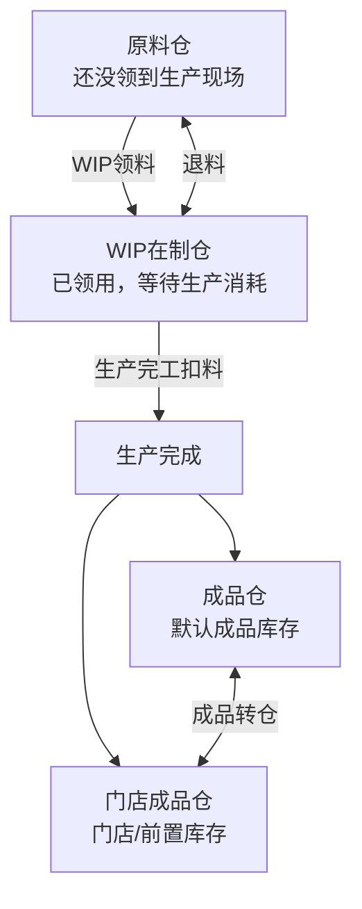
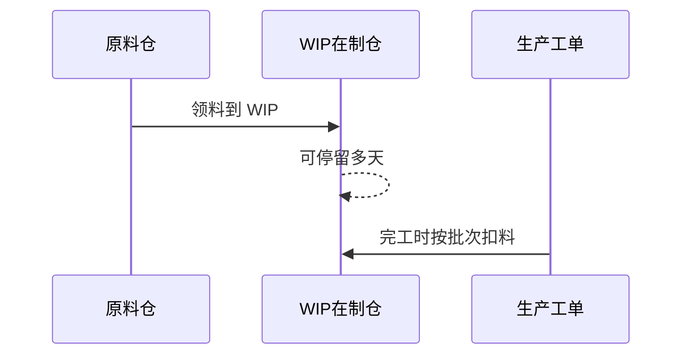

# 生产流程用户手册

适用范围：当前生产、库存、WIP、工单、成品入库与批次追溯流程。

## 1. 一张图看懂流程

一句话版本：

> 先把原料入库，再把要生产用的原料领到 WIP，在生产计划里开始生产，按工单生产，最后在“生产中”完成入库。

## 2. 每天怎么用

| 时间点 | 去哪里 | 做什么 | 结果 |
| --- | --- | --- | --- |
| 生产前 | 商品与配方 / 设置 | 确认商品、BOM 配方、设备产能 | 生产计划能算出建议投料 |
| 原料到货 | 库存管理 -> 库存作业 -> 原料入库 | 录入原料、数量、成本 | 生成原料批次和原料仓库存 |
| 准备生产 | 库存管理 -> 库存作业 -> WIP领退/转仓 | 把原料从原料仓领到 WIP | 生产现场有可消耗库存 |
| 排产 | 生产管理 -> 生产计划/开始生产 | 选择要生产的商品，确认投料 | 生成生产中记录和生产工单 |
| 生产中 | 生产管理 -> 生产工单 | 看烘焙建议、原料需求，打印工单 | 现场按工单执行 |
| 生产后 | 生产管理 -> 生产中 | 填实际产出，选择成品入库仓 | 扣 WIP 原料，生成成品库存 |
| 复盘 | 库存管理 -> 仓库库存 | 查库存、查 FP 成品批次追溯 | 看到成品用了哪些原料批次 |

## 3. 仓库怎么理解

| 仓库 | 放什么 | 什么时候用 |
| --- | --- | --- |
| 原料仓 | 生豆、包材等未领用库存 | 原料入库后默认在这里 |
| WIP在制仓 | 已领到生产现场但还没被消耗的原料 | 生产完工时只从这里扣原料 |
| 成品仓 | 正常成品库存 | 完成生产后默认入这里 |
| 门店成品仓 | 门店、前置仓或展示库存 | 成品转仓或完工时选择入这里 |
| 损耗/报废仓 | 损耗、报废、异常库存 | 盘点或异常处理时使用 |

WIP 不是一次生产必须用完。比如先领用 60kg 生豆 A 到 WIP，这 60kg 可以放 3 天，也可以被 6 个不同商品分批消耗。没用完的可以继续留在 WIP，也可以退回原料仓。

## 4. 操作步骤

### 第 0 步：先准备基础资料

| 资料 | 菜单入口 | 目的 |
| --- | --- | --- |
| 商品 | 商品与配方 -> 商品档案 | 系统知道要生产什么 |
| BOM 配方 | 商品与配方 -> BOM配方维护 | 系统知道每个商品用哪些原料 |
| 物料 | 库存管理 -> 物料档案 | 系统知道有哪些生豆、包材 |
| 设备 | 设置 -> 设备产能配置 | 工单能给出设备、锅次建议 |

### 第 1 步：原料入库

入口：`库存管理 -> 库存作业 -> 原料入库`

操作：

1. 选择物料。
2. 填入入库数量、成本或备注。
3. 提交入库。

结果：

- 生成原料批次。
- 增加原料仓库存。
- 后续可以把这个批次领到 WIP。

### 第 2 步：领料到 WIP

入口：`库存管理 -> 库存作业 -> WIP领退/转仓`

操作：

1. 类型选择“领料到 WIP”。
2. 选择原料批次。
3. 填入领用数量。
4. 提交。

结果：

- 原料从原料仓移动到 WIP。
- 物料总库存不变，只是仓库位置变化。
- 生产完工时，系统只消耗 WIP 里的原料。

需要退料时：

- 类型选择“退回原料仓”。
- 把未使用的 WIP 原料退回原料仓。

### 第 3 步：开始生产

入口：`生产管理 -> 生产计划/开始生产`

操作：

1. 查看需要生产的商品。
2. 选择要生产的行。
3. 检查烘焙建议、建议投料、BOM 原料需求。
4. 确认投料克重。
5. 点击开始生产。

结果：

- 生成“生产中”记录。
- 生成生产工单。
- 系统冻结当时的 BOM 和原料快照。

重要规则：

- 开始生产时不会扣 WIP 库存。
- 完成生产时才会扣 WIP 库存。
- 开始后再改 BOM，不会影响已经生成的这个工单。

### 第 4 步：查看和打印工单

入口：`生产管理 -> 生产工单`

工单里重点看：

| 区域 | 用途 |
| --- | --- |
| 商品和规格 | 确认生产对象 |
| 烘焙建议 | 给烘焙师现场参考 |
| 建议投料 | 确认本次投入克重 |
| 原料摘要 | 确认需要哪些原料 |
| 订单信息 | 确认对应订单 |

需要纸质工单时：

1. 打开目标工单。
2. 点击打印。
3. 交给生产现场。

### 第 5 步：完成生产

入口：`生产管理 -> 生产中`

操作：

1. 找到正在生产的记录。
2. 填实际产出件数。
3. 如有散重，填散重克数。
4. 选择成品入库仓，例如成品仓或门店成品仓。
5. 点击完成。

完成后系统会自动做这些事：

| 自动动作 | 说明 |
| --- | --- |
| 扣 WIP 原料 | 按工单冻结的原料快照，从 WIP 批次扣料 |
| 生成成品批次 | 成品批次号通常是 `FP-...` |
| 增加成品库存 | 进入你选择的成品仓 |
| 写生产日志 | 记录实际产出和生产批次 |
| 写成本记录 | 生产成本页面可查看 |
| 建立追溯链路 | 成品批次可以追到原料批次 |

### 第 6 步：成品转仓

入口：`库存管理 -> 库存作业 -> 成品转仓`

适用场景：

- 成品仓转到门店成品仓。
- 门店成品仓退回成品仓。
- 不同成品仓之间调拨。

操作：

1. 选择商品和规格。
2. 选择来源仓。
3. 选择目标仓。
4. 填转仓数量。
5. 提交。

结果：

- 成品总库存不变。
- 只是成品所在仓库变化。

### 第 7 步：查询和追溯

入口：`库存管理 -> 仓库库存`

能查什么：

| 查询内容 | 怎么看 |
| --- | --- |
| 原料库存 | 选择原料仓或 WIP 仓 |
| 成品库存 | 选择成品仓或门店成品仓 |
| 批次余额 | 展开库存明细 |
| 成品追溯 | 输入 `FP-...` 成品批次 |

追溯结果会显示：

## 5. 常见问题

| 问题 | 原因 | 处理方法 |
| --- | --- | --- |
| WIP库存不足 | 原料只在原料仓，没有领到 WIP | 去“库存作业 -> WIP领退/转仓”先领料 |
| 物料档案显示有库存，但生产仍提示不足 | 总库存充足不等于 WIP 充足 | 查“仓库库存”，确认该物料在 WIP 有余额 |
| 工单原料和最新 BOM 不一样 | 工单开始时已经冻结快照 | 这是正常规则；新 BOM 只影响后续工单 |
| 找不到追溯 | 输入的不是成品批次 | 使用 `FP-...` 成品批次查询 |
| 生产计划没有商品 | 没有库存缺口或订单已生产 | 检查订单、成品库存和生产状态 |
| 成品放错仓 | 完工时选错入库仓 | 用“库存作业 -> 成品转仓”调整 |

## 6. 现场检查清单

生产前检查：

- 商品档案已建好。
- BOM 配方已启用。
- 原料已经入库。
- 生产要用的原料已经领到 WIP。
- 生产计划里已经开始生产。
- 生产工单已打印或现场可查看。

生产后检查：

- “生产中”记录已经完成。
- 成品进入正确仓库。
- WIP 原料余额减少。
- “生产日志”能看到本次记录。
- “生产成本”能看到本次成本。
- “仓库库存”里用 `FP-...` 批次能追溯到原料批次。

## 7. 最关键的三条规则

1. 原料入库只进原料仓，生产不能直接消耗原料仓。
2. 生产完工只消耗 WIP 在制仓，所以生产前必须先领料到 WIP。
3. 工单开始后会冻结 BOM 和原料快照，保证后续追溯按当时的生产依据走。
