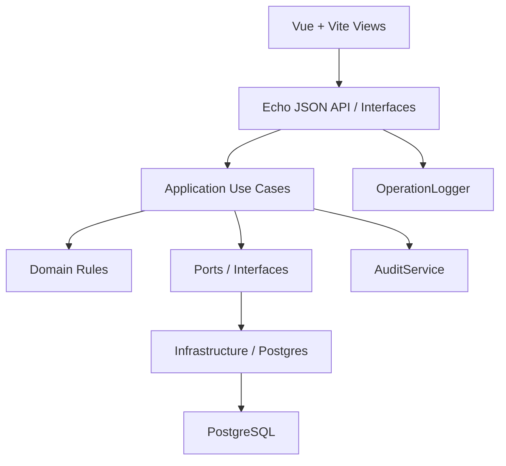

# 架构升级实施计划

> **给 agentic workers：** 必须使用子技能 `superpowers:subagent-driven-development`（推荐）或 `superpowers:executing-plans` 按任务逐项执行。所有步骤使用 checkbox（`- [ ]`）追踪。

**目标：** 在业务继续膨胀前，把 KFerp 从“Vue 壳 + HTML 模板 + main 包巨石”的混合迁移架构，升级为“Vue/Vite + JSON API + Application/Domain/Repository 分层架构”。

**架构方向：** 按垂直切片升级，不做一次性全系统大重构。每个切片都必须保持可部署、测试通过、旧入口兼容；新用户可见页面统一走 Vue/Vite，后端通过 JSON API 暴露，业务编排进入 application service，SQL 下沉到 repository/infra。

**技术栈：** Go、Echo、pgx/PostgreSQL、Vue 3 + Vite、现有 5 张需求管理表、`go test`、handler/API 测试、前端 build 验证。

---

## 总原则

- 不在 `develop` 上直接做架构升级，使用独立分支：`codex/architecture-upgrade-20260426`。
- 每个任务一个提交，任务之间都要保持 `go test ./...` 可通过。
- 任何触碰页面的功能都必须迁到 Vue/Vite，不再给 `templates/*.html` 增加用户功能。
- Echo handler 只负责 HTTP 解析、鉴权、调用 use case、返回 JSON。
- Application 层负责编排业务流程。
- Domain 层只放纯业务规则，不碰 DB、不碰 Echo。
- Repository/Infrastructure 层只做 SQL、事务、文件和外部 IO。
- 请求日志和业务审计分离：`OperationLogger -> operation_logs`，`AuditService -> audit_logs`。

---

## 目标分层



---

## 文件规划

### 新增或扩展

- `orderapp-remote/review_architecture_guard_test.go`
  - 架构护栏测试，防止工作流、模板、生产流程拆分回退。
- `orderapp-remote/audit_schema.go`
  - `audit_logs`、`order_audit_logs`、`operation_logs` 建表。
- `orderapp-remote/audit_service_test.go`
  - 审计服务和事务审计 helper 的护栏测试。
- `orderapp-remote/internal/ports/unit_of_work.go`
  - 后续 application service 使用的事务边界接口。
- `orderapp-remote/internal/domain/production/*.go`
  - 生产相关纯规则：投料、出品率、库存计划。
- `orderapp-remote/internal/application/production/service.go`
  - 生产 use cases：计划、开始生产、完成生产、取消、日志。
- `orderapp-remote/internal/infrastructure/postgres/production_repository.go`
  - 生产模块 SQL 实现。
- `orderapp-remote/internal/interfaces/http/production_handlers.go`
  - 后续生产 JSON API 的 Echo handlers。
- `orderapp-remote/frontend-vue-shell/src/views/ProduceRunningView.vue`
  - 替代旧 `produce_running.html`。
- `orderapp-remote/frontend-vue-shell/src/views/ProductionLogsView.vue`
  - 替代旧 `production_logs.html`。
- `orderapp-remote/frontend-vue-shell/src/api/production.js`
  - 生产模块前端 API client。

### 修改

- `HOW_TO_WORKFLOW.md`
  - 对齐“测试先行 + Vue/Vite 规则”。
- `orderapp-remote/docs/superpowers/plans/2026-04-25-production-log-yield.md`
  - 纠正旧计划，不再指导扩 HTML template。
- `orderapp-remote/frontend-vue-shell/src/App.vue`
  - 挂载迁移后的 Vue 内部页面。
- `orderapp-remote/static_frontend_routes.go`
  - 旧页面 URL 重定向到 Vue shell。
- `orderapp-remote/app_routes.go`
  - 注册更小的 JSON API handler。
- `orderapp-remote/production_flow.go`
  - 逐步缩小，只保留尚未迁出的核心逻辑，最终迁入 application/domain/repository。
- `orderapp-remote/production_flow_routes.go`
  - 过渡期路由文件，最终只保留兼容入口或迁入 interfaces/http。
- `orderapp-remote/production_flow_schema.go`
  - 过渡期 schema bootstrap，后续迁入 infra/migration。
- `orderapp-remote/audit_unified.go`
  - 统一 `AuditService`。
- `orderapp-remote/operation_log.go`
  - 请求级 `OperationLogger`。
- `orderapp-remote/internal/application/sales/service.go`
  - 后续从 repo wrapper 改成真正订单 use case。
- `orderapp-remote/order_routes.go`
- `orderapp-remote/sales_order_repository.go`
  - 后续迁订单模块。
- `orderapp-remote/materials.go`
- `orderapp-remote/bom_api.go`
  - 后续迁物料/BOM 模块。

---

## 任务 1：建立架构护栏

**文件：**

- 新增/修改：`orderapp-remote/review_architecture_guard_test.go`
- 修改：`HOW_TO_WORKFLOW.md`
- 修改：`orderapp-remote/docs/superpowers/plans/2026-04-25-production-log-yield.md`

- [ ] **步骤 1：从最新集成分支开架构分支**

```bash
cd /Users/yiiiple-work/Documents/KFerp
git fetch origin
git switch -c codex/architecture-upgrade-20260426 origin/develop
```

期望：

- 当前分支不是 `develop`
- 分支基于最新 `origin/develop`

- [ ] **步骤 2：先写失败的护栏测试**

在 `orderapp-remote/review_architecture_guard_test.go` 加：

```go
func TestWorkflowRequiresTestsBeforeImplementation(t *testing.T) {
	body, err := os.ReadFile("../HOW_TO_WORKFLOW.md")
	if err != nil {
		t.Fatal(err)
	}
	content := string(body)
	testFirst := strings.Index(content, "先编写单元测试代码")
	implementation := strings.Index(content, "实现代码")
	if testFirst < 0 || implementation < 0 || testFirst > implementation {
		t.Fatal("workflow must require unit/API tests before implementation")
	}
}

func TestProductionLogPlanDoesNotExtendLegacyTemplates(t *testing.T) {
	body, err := os.ReadFile("docs/superpowers/plans/2026-04-25-production-log-yield.md")
	if err != nil {
		t.Fatal(err)
	}
	content := string(body)
	for _, forbidden := range []string{
		"Extend the existing server-rendered production workflow",
		"server-rendered HTML templates",
		"templates/production_logs.html",
		"templates/unprod_summary.html",
		"templates/produce_running.html",
	} {
		if strings.Contains(content, forbidden) {
			t.Fatalf("plan still directs legacy template work: %q", forbidden)
		}
	}
}
```

- [ ] **步骤 3：验证 RED**

```bash
cd /Users/yiiiple-work/Documents/KFerp/orderapp-remote
go test ./... -run 'TestWorkflowRequiresTestsBeforeImplementation|TestProductionLogPlanDoesNotExtendLegacyTemplates'
```

期望：

- 修改前失败。

- [ ] **步骤 4：修正工作流和旧计划**

修改内容：

- `HOW_TO_WORKFLOW.md`
  - PR 入表
  - DEV 拆解
  - UT/API 测试设计入表
  - 先写失败测试
  - 再实现
  - 跑 UT/API 并记录证据
  - REV 审核
  - 最后部署
- `2026-04-25-production-log-yield.md`
  - 改为 Vue/Vite + JSON API
  - 旧 URL 只做重定向或兼容
  - 不再新增或扩展 template 页面

- [ ] **步骤 5：验证 GREEN**

```bash
cd /Users/yiiiple-work/Documents/KFerp/orderapp-remote
go test ./... -run 'TestWorkflowRequiresTestsBeforeImplementation|TestProductionLogPlanDoesNotExtendLegacyTemplates'
```

期望：

- 测试通过。

- [ ] **步骤 6：提交**

```bash
git add HOW_TO_WORKFLOW.md orderapp-remote/docs/superpowers/plans/2026-04-25-production-log-yield.md orderapp-remote/review_architecture_guard_test.go
git commit -m "chore: add architecture workflow guardrails"
```

---

## 任务 2：拆分请求日志和业务审计

**文件：**

- 新增：`orderapp-remote/audit_schema.go`
- 新增：`orderapp-remote/audit_service_test.go`
- 修改：`orderapp-remote/audit_unified.go`
- 修改：`orderapp-remote/operation_log.go`
- 修改：`orderapp-remote/operation_log_test.go`
- 修改：`orderapp-remote/audit.go`

- [ ] **步骤 1：先写失败测试**

在 `operation_log_test.go` 加：

```go
func TestOperationLogDoesNotMirrorRequestsIntoAuditLogs(t *testing.T) {
	body, err := os.ReadFile("operation_log.go")
	if err != nil {
		t.Fatal(err)
	}
	content := string(body)
	if strings.Contains(content, "auditInsert(") {
		t.Fatal("operation log should not mirror request rows into audit_logs")
	}
	if strings.Contains(content, "entity_type") {
		t.Fatal("operation_log.go should not know audit_logs schema details")
	}
}
```

新增 `audit_service_test.go`：

```go
func TestAuditUnifiedOwnsAuditServiceAndTxHelper(t *testing.T) {
	body, err := os.ReadFile("audit_unified.go")
	if err != nil {
		t.Fatal(err)
	}
	content := string(body)
	for _, want := range []string{"type AuditService struct", "type AuditEntry struct", "func auditInsertTx"} {
		if !strings.Contains(content, want) {
			t.Fatalf("audit_unified.go missing %q", want)
		}
	}
}

func TestInlineOrderAuditUsesTransactionHelper(t *testing.T) {
	body, err := os.ReadFile("audit.go")
	if err != nil {
		t.Fatal(err)
	}
	content := string(body)
	if strings.Contains(content, "auditInsert(ctx, pool") {
		t.Fatal("inline order updates should write audit rows through the same transaction")
	}
	if !strings.Contains(content, "auditInsertTx(ctx, tx") {
		t.Fatal("inline order updates should use auditInsertTx")
	}
}
```

- [ ] **步骤 2：验证 RED**

```bash
cd /Users/yiiiple-work/Documents/KFerp/orderapp-remote
go test ./... -run 'TestOperationLogDoesNotMirrorRequestsIntoAuditLogs|TestAuditUnifiedOwnsAuditServiceAndTxHelper|TestInlineOrderAuditUsesTransactionHelper'
```

期望：

- 修改前失败。

- [ ] **步骤 3：实现日志拆分**

实现内容：

- `audit_schema.go`
  - 移入 `audit_logs / order_audit_logs / operation_logs` 建表。
- `audit_unified.go`
  - 新增 `AuditEntry`
  - 新增 `AuditService`
  - 新增 `auditInsertTx`
- `operation_log.go`
  - 新增 `OperationLogger`
  - 请求日志只写 `operation_logs`
  - 删除对 `auditInsert` 的调用
- `audit.go`
  - inline 订单变更审计改用 `auditInsertTx(ctx, tx, ...)`

- [ ] **步骤 4：验证 GREEN**

```bash
cd /Users/yiiiple-work/Documents/KFerp/orderapp-remote
go test ./... -run 'TestOperationLogDoesNotMirrorRequestsIntoAuditLogs|TestAuditUnifiedOwnsAuditServiceAndTxHelper|TestInlineOrderAuditUsesTransactionHelper'
go test ./...
```

期望：

- focused tests 通过
- 全量 Go 测试通过

- [ ] **步骤 5：提交**

```bash
git add orderapp-remote/audit_schema.go orderapp-remote/audit_service_test.go orderapp-remote/audit_unified.go orderapp-remote/operation_log.go orderapp-remote/operation_log_test.go orderapp-remote/audit.go
git commit -m "refactor: separate operation logging and audit service"
```

---

## 任务 3：生产日志迁到 Vue + JSON API

**文件：**

- 新增：`orderapp-remote/frontend-vue-shell/src/views/ProductionLogsView.vue`
- 修改：`orderapp-remote/frontend-vue-shell/src/App.vue`
- 修改：`orderapp-remote/production_logs_page.go`
- 修改：`orderapp-remote/production_logs_page_test.go`

- [ ] **步骤 1：写失败的 Vue/API 测试**

修改 `production_logs_page_test.go`：

```go
func TestProductionLogsVueContainsKeyColumns(t *testing.T) {
	body, err := os.ReadFile("frontend-vue-shell/src/views/ProductionLogsView.vue")
	if err != nil {
		t.Fatal(err)
	}
	content := string(body)
	for _, needle := range []string{"生产日志", "真实出品率", "投料数(g)", "完成时间", "/api/produce/logs"} {
		if !strings.Contains(content, needle) {
			t.Fatalf("ProductionLogsView.vue missing %q", needle)
		}
	}
}
```

- [ ] **步骤 2：验证 RED**

```bash
cd /Users/yiiiple-work/Documents/KFerp/orderapp-remote
go test ./... -run 'TestProductionLogsVueContainsKeyColumns'
```

期望：

- `ProductionLogsView.vue` 不存在时失败。

- [ ] **步骤 3：实现 Vue/API**

实现内容：

- 新增 `GET /api/produce/logs`
- `GET /produce/logs` 重定向到 `/vue-shell?view=produceLogs`
- 新增 `ProductionLogsView.vue`，通过 `/api/produce/logs` 拉数据
- `App.vue` 挂载 `produceLogs` 为内部 Vue view

- [ ] **步骤 4：验证**

```bash
cd /Users/yiiiple-work/Documents/KFerp/orderapp-remote
go test ./... -run 'TestProductionLogsVueContainsKeyColumns|TestProductionLogPagesExposeJSONAPIAndVueRedirect|TestProductionMenusContainLogsEntry'
cd frontend-vue-shell && npm run build
```

期望：

- focused tests 通过
- Vue shell build 通过

- [ ] **步骤 5：提交**

```bash
git add orderapp-remote/production_logs_page.go orderapp-remote/production_logs_page_test.go orderapp-remote/frontend-vue-shell/src/App.vue orderapp-remote/frontend-vue-shell/src/views/ProductionLogsView.vue
git commit -m "refactor: move production logs to vue api view"
```

---

## 任务 4：拆分生产流程文件职责

**文件：**

- 新增：`orderapp-remote/production_flow_routes.go`
- 新增：`orderapp-remote/production_flow_schema.go`
- 修改：`orderapp-remote/production_flow.go`
- 修改：`orderapp-remote/review_architecture_guard_test.go`

- [ ] **步骤 1：写失败的拆分测试**

新增：

```go
func TestProductionFlowRoutesAndSchemaAreSplitOut(t *testing.T) {
	body, err := os.ReadFile("production_flow.go")
	if err != nil {
		t.Fatal(err)
	}
	content := string(body)
	for _, forbidden := range []string{
		"func registerProductionFlowPages",
		"func ensureProductionRunTable",
		"e.POST(\"/produce/start\"",
	} {
		if strings.Contains(content, forbidden) {
			t.Fatalf("production_flow.go still owns split-out concern %q", forbidden)
		}
	}
}
```

- [ ] **步骤 2：验证 RED**

```bash
cd /Users/yiiiple-work/Documents/KFerp/orderapp-remote
go test ./... -run 'TestProductionFlowRoutesAndSchemaAreSplitOut'
```

期望：

- `production_flow.go` 仍包含 routes/schema 时失败。

- [ ] **步骤 3：无行为变化地移动代码**

移动：

- `registerProductionFlowPages`、请求结构、请求解析 helper -> `production_flow_routes.go`
- `ensureProductionRunTable` -> `production_flow_schema.go`

保持函数名不变，避免改调用方。

- [ ] **步骤 4：验证**

```bash
cd /Users/yiiiple-work/Documents/KFerp/orderapp-remote
go test ./... -run 'TestProductionFlowRoutesAndSchemaAreSplitOut|TestProduceStartAPIUsesSubmittedInputG|TestProduceFinishHandlerWritesProductionLog'
go test ./...
```

期望：

- focused tests 通过
- 全量 Go 测试通过

- [ ] **步骤 5：提交**

```bash
git add orderapp-remote/production_flow.go orderapp-remote/production_flow_routes.go orderapp-remote/production_flow_schema.go orderapp-remote/review_architecture_guard_test.go
git commit -m "refactor: split production flow routes and schema"
```

---

## 任务 5：抽取生产 Application Service

**文件：**

- 新增/修改：`orderapp-remote/internal/application/production/service.go`
- 新增：`orderapp-remote/internal/application/production/service_flow_test.go`
- 新增：`orderapp-remote/internal/domain/production/yield.go`
- 新增：`orderapp-remote/internal/domain/production/yield_test.go`
- 新增：`orderapp-remote/internal/infrastructure/postgres/production_repository.go`
- 修改：`orderapp-remote/production_flow.go`
- 修改：`orderapp-remote/production_flow_routes.go`

- [ ] **步骤 1：先把纯生产计算迁到 domain**

新增 `internal/domain/production/yield_test.go`：

```go
func TestDefaultInputGramsUsesYieldRate(t *testing.T) {
	got := DefaultInputGrams(800, 0.8)
	if got != 1000 {
		t.Fatalf("DefaultInputGrams() = %d, want 1000", got)
	}
}

func TestActualYieldRateRoundsToFourDecimals(t *testing.T) {
	got, err := ActualYieldRate(227, 3, 19, 1000)
	if err != nil {
		t.Fatal(err)
	}
	if got != 0.7000 {
		t.Fatalf("ActualYieldRate() = %.4f, want 0.7000", got)
	}
}
```

- [ ] **步骤 2：验证 RED**

```bash
cd /Users/yiiiple-work/Documents/KFerp/orderapp-remote
go test ./internal/domain/production
```

期望：

- package/functions 不存在时失败。

- [ ] **步骤 3：实现 domain 计算**

新增 `internal/domain/production/yield.go`：

```go
package production

import (
	"fmt"
	"math"
)

func NormalizeYieldRate(rate float64) float64 {
	if rate <= 0 || rate > 1 {
		return 0.8
	}
	return rate
}

func DefaultInputGrams(needG int64, yieldRate float64) int64 {
	if needG <= 0 {
		return 0
	}
	return int64(math.Ceil(float64(needG) / NormalizeYieldRate(yieldRate)))
}

func FinishedTotalGrams(specG, units, looseG int64) int64 {
	if specG <= 0 || units < 0 || looseG < 0 {
		return 0
	}
	return units*specG + looseG
}

func ActualYieldRate(specG, units, looseG, inputG int64) (float64, error) {
	if inputG <= 0 {
		return 0, fmt.Errorf("input_g must be greater than 0")
	}
	total := FinishedTotalGrams(specG, units, looseG)
	rate := float64(total) / float64(inputG)
	return math.Round(rate*10000) / 10000, nil
}
```

- [ ] **步骤 4：定义生产 use case 接口**

在 `internal/application/production/service.go` 中定义：

```go
type RunningItem struct {
	ID           int64
	BatchID      string
	ProductID    int64
	ProductName  string
	SpecG        int64
	NeedG        int64
	InputG       int64
	BomYieldRate float64
	OrderNos     string
}

type Repository interface {
	ListRunning(ctx context.Context) ([]RunningItem, error)
	Start(ctx context.Context, cmd StartCommand) (string, error)
	Finish(ctx context.Context, cmd FinishCommand) error
	Cancel(ctx context.Context, cmd CancelCommand) error
}
```

- [ ] **步骤 5：路由调用 application service**

要求：

- `production_flow_routes.go` 只做 HTTP 解析
- 业务编排进入 `internal/application/production`
- SQL 进入 repository/infra

- [ ] **步骤 6：验证**

```bash
cd /Users/yiiiple-work/Documents/KFerp/orderapp-remote
go test ./internal/domain/production ./internal/application/production
go test ./...
```

期望：

- domain/application 测试通过
- 全量 Go 测试通过

- [ ] **步骤 7：提交**

```bash
git add orderapp-remote/internal/domain/production orderapp-remote/internal/application/production orderapp-remote/internal/infrastructure/postgres/production_repository.go orderapp-remote/production_flow.go orderapp-remote/production_flow_routes.go
git commit -m "refactor: extract production application service"
```

---

## 任务 6：生产中页面迁 Vue

**文件：**

- 新增：`orderapp-remote/frontend-vue-shell/src/views/ProduceRunningView.vue`
- 新增/修改：`orderapp-remote/frontend-vue-shell/src/api/production.js`
- 修改：`orderapp-remote/frontend-vue-shell/src/App.vue`
- 修改：`orderapp-remote/production_flow_routes.go`
- 测试：`orderapp-remote/production_flow_api_test.go`

- [ ] **步骤 1：新增 API contract 测试**

覆盖：

- `GET /api/produce/running`
- `POST /api/produce/running/finish`
- `POST /api/produce/running/cancel`

期望响应示例：

```json
{
  "rows": [
    {
      "id": 1,
      "batch_id": "PB-1",
      "product_name": "测试产品",
      "input_g": 1000,
      "bom_yield_rate": 0.8
    }
  ]
}
```

- [ ] **步骤 2：验证 RED**

```bash
cd /Users/yiiiple-work/Documents/KFerp/orderapp-remote
go test ./... -run 'TestProduceRunningAPI'
```

期望：

- JSON endpoint 不存在时失败。

- [ ] **步骤 3：实现 JSON endpoint 和 Vue 页面**

实现：

- `GET /api/produce/running`
- `POST /api/produce/running/finish`
- `POST /api/produce/running/cancel`
- `ProduceRunningView.vue`
- `/produce/running` 重定向到 `/vue-shell?view=produceRunning`

- [ ] **步骤 4：验证**

```bash
cd /Users/yiiiple-work/Documents/KFerp/orderapp-remote
go test ./... -run 'TestProduceRunningAPI|TestProduceFinishHandlerWritesProductionLog'
cd frontend-vue-shell && npm run build
```

期望：

- focused tests 通过
- Vue shell build 通过

- [ ] **步骤 5：提交**

```bash
git add orderapp-remote/production_flow_routes.go orderapp-remote/production_flow_api_test.go orderapp-remote/frontend-vue-shell/src/App.vue orderapp-remote/frontend-vue-shell/src/views/ProduceRunningView.vue orderapp-remote/frontend-vue-shell/src/api/production.js
git commit -m "refactor: migrate running production page to vue"
```

---

## 任务 7：升级销售/订单 Application Service

**文件：**

- 修改：`orderapp-remote/internal/application/sales/service.go`
- 修改：`orderapp-remote/internal/application/sales/service_test.go`
- 新增：`orderapp-remote/internal/domain/sales/order.go`
- 新增：`orderapp-remote/internal/domain/sales/order_test.go`
- 修改：`orderapp-remote/order_routes.go`
- 修改：`orderapp-remote/sales_order_repository.go`

- [ ] **步骤 1：定义 typed application command**

目标结构：

```go
type SaveOrderCommand struct {
	Actor          string
	EditID         int64
	OrderDate      time.Time
	CustomerID     int64
	SourceID       int64
	OrderTypeID    int64
	PayStatusID    int64
	ShipStatusID   int64
	ShippingAmount float64
	DiscountAmount float64
	RoundToInt      bool
	Items           []OrderItemCommand
}

type OrderItemCommand struct {
	ProductID   *int64
	TierID      *int64
	ManualPrice *float64
	Name        string
	Units       int64
	SpecG       int64
}
```

- [ ] **步骤 2：表单解析留在 HTTP 层**

要求：

- `order_routes.go` 负责把字符串表单解析成 typed command
- `sales_order_repository.go` 不再解析 HTTP form array

- [ ] **步骤 3：价格决策迁到 domain/application**

迁移规则：

- 零售/批发判断
- 精确零售规格价格 vs 227g fallback
- 阶梯价匹配
- 手动价格 override
- 抹零

Repository 只负责读取价格数据和保存订单。

- [ ] **步骤 4：验证**

```bash
cd /Users/yiiiple-work/Documents/KFerp/orderapp-remote
go test ./internal/domain/sales ./internal/application/sales
go test ./... -run 'TestSaveOrder|TestRetail|TestOrder'
go test ./...
```

期望：

- sales domain/application 测试通过
- 订单 API/regression 测试通过
- 全量 Go 测试通过

- [ ] **步骤 5：提交**

```bash
git add orderapp-remote/internal/domain/sales orderapp-remote/internal/application/sales orderapp-remote/order_routes.go orderapp-remote/sales_order_repository.go
git commit -m "refactor: make sales service own order use cases"
```

---

## 任务 8：迁移物料和 BOM

**文件：**

- 新增：`orderapp-remote/internal/application/materials/service.go`
- 新增：`orderapp-remote/internal/domain/materials/*.go`
- 新增：`orderapp-remote/internal/infrastructure/postgres/materials_repository.go`
- 新增：`orderapp-remote/frontend-vue-shell/src/views/MaterialsView.vue`
- 修改：`orderapp-remote/materials.go`
- 修改：`orderapp-remote/materials_page.go`
- 修改：`orderapp-remote/bom_api.go`
- 修改：`orderapp-remote/frontend-vue-shell/src/App.vue`

- [ ] **步骤 1：新增物料 API 测试**

覆盖：

- 物料列表
- 物料新增/更新
- 库存数量
- 采购价/销售价

- [ ] **步骤 2：实现 application/repository 拆分**

要求：

- handler 不直接写 SQL
- 物料业务规则进入 application/domain
- SQL 进入 repository/infra

- [ ] **步骤 3：新增 Vue 物料页面**

`MaterialsView.vue` 消费 JSON API，替代 `/materials` template 行为。

- [ ] **步骤 4：验证**

```bash
cd /Users/yiiiple-work/Documents/KFerp/orderapp-remote
go test ./... -run 'TestMaterials'
cd frontend-vue-shell && npm run build
go test ./...
```

期望：

- materials 测试通过
- Vue shell build 通过
- 全量 Go 测试通过

- [ ] **步骤 5：提交**

```bash
git add orderapp-remote/internal/application/materials orderapp-remote/internal/domain/materials orderapp-remote/internal/infrastructure/postgres/materials_repository.go orderapp-remote/materials.go orderapp-remote/materials_page.go orderapp-remote/frontend-vue-shell/src/views/MaterialsView.vue orderapp-remote/frontend-vue-shell/src/App.vue
git commit -m "refactor: migrate materials to layered vue api"
```

---

## 任务 9：最终架构验收

**文件：**

- 修改：`orderapp-remote/review_architecture_guard_test.go`
- 修改：`orderapp-remote/docs/REQUIREMENTS.md`（如果架构需求也镜像到文档）
- 更新：系统内 5 张需求管理表

- [ ] **步骤 1：新增最终架构 gate 测试**

新增：

```go
func TestVueShellOwnsMigratedProductionViews(t *testing.T) {
	body, err := os.ReadFile("frontend-vue-shell/src/App.vue")
	if err != nil {
		t.Fatal(err)
	}
	content := string(body)
	for _, want := range []string{"ProducePlanView", "ProduceRunningView", "ProductionLogsView"} {
		if !strings.Contains(content, want) {
			t.Fatalf("App.vue missing migrated production view %q", want)
		}
	}
}
```

- [ ] **步骤 2：全量验证**

```bash
cd /Users/yiiiple-work/Documents/KFerp/orderapp-remote
go test ./...
cd frontend-vue-shell && npm run build
cd ../frontend && npm run build
```

期望：

- Go 全量测试通过
- Vue shell build 通过
- React BOM build 通过

- [ ] **步骤 3：更新 5 张需求表**

创建/完成：

- `PR-ARCH-001` 架构升级：Vue/Vite + 分层后端
- `DEV-ARCH-001` 工作流与架构护栏
- `DEV-ARCH-002` 日志/审计服务解耦
- `DEV-ARCH-003` 生产流程分层
- `DEV-ARCH-004` 生产页面 Vue/API 迁移
- `DEV-ARCH-005` 销售服务 use case 化
- `DEV-ARCH-006` 物料/BOM 分层迁移
- 对应 `UT-ARCH-*`
- 对应 `API-ARCH-*`
- 对应 `REV-ARCH-*`

- [ ] **步骤 4：推分支并开草稿 PR**

```bash
git status --short
git push -u origin codex/architecture-upgrade-20260426
```

期望：

- 分支成功推送
- PR 描述包含任务完成情况和验证证据

---

## 验收清单

- [ ] `HOW_TO_WORKFLOW.md` 明确测试先行。
- [ ] 修正后的计划不再指导新用户功能进入 `templates/*.html`。
- [ ] 生产计划、生产中、生产日志进入 Vue internal view，或在本计划中明确排入迁移任务。
- [ ] 请求日志只写 `operation_logs`。
- [ ] 业务审计通过 `AuditService` 写入。
- [ ] 事务敏感的业务审计使用 `auditInsertTx`。
- [ ] `production_flow.go` 不再拥有路由注册或 schema DDL。
- [ ] 生产 use case 进入 `internal/application/production`。
- [ ] 生产纯规则进入 `internal/domain/production`。
- [ ] 生产 SQL 进入 repository/infra。
- [ ] sales service 不再只是 repository passthrough。
- [ ] `go test ./...` 通过。
- [ ] `frontend-vue-shell npm run build` 通过。
- [ ] `frontend npm run build` 通过。
- [ ] 5 张需求表写入 PR/DEV/UT/API/REV 证据。

## 执行建议

等所有活跃功能流合入 `origin/develop` 后执行本计划。每个任务单独提交，每个任务后都跑验证。不要把半成品架构改造合入 `develop`；只有应用仍可部署、测试和构建都通过时，才允许合入。
