# 源头工厂客户服务平台设计

日期：2026-05-03

## 背景

KFerp 当前服务的是棵凡作为咖啡源头工厂的订单、生产、库存、发货和财务流程。后续客户侧入口不应要求客户打开浏览器，而应通过微信小程序登录查看和提交业务。

客户名称会不断变化：渠道客户、代加工客户、品牌代理客户、批发客户、零售客户、团购客户、联名客户、门店寄售客户等都可能出现。系统不能围绕固定客户类型枚举建模。核心应抽象为：合作主体如何使用源头工厂的服务能力，并围绕履约和结算形成闭环。

## 总体目标

- 小程序作为客户自助入口。
- ERP 后台作为内部操作入口。
- PostgreSQL / ERP 后端作为唯一业务数据源。
- 客户侧功能统一走 `/api/mini/*` 客户门户 API，不直接开放内部后台 API。
- 客户类型只作为标签和预设套餐，真正控制系统的是服务能力、资源账户、商务规则和数据权限。

## 核心抽象

### 客户 / 合作主体

客户是业务合作主体，可以是公司、门店、品牌方、渠道商、代理商或个人。一个客户可以绑定多个小程序用户，一个小程序用户也可以在授权后切换多个客户主体。

客户主体具备：

- 身份信息：客户档案、联系人、公司信息、收货信息。
- 登录绑定：微信 openid / unionid 与 ERP 客户主体绑定。
- 客户标签：渠道、代加工、品牌代理、批发、零售等可多选标签。
- 服务能力：决定小程序显示哪些模块、允许提交哪些业务。
- 商务规则：价格、账期、结算周期、运费规则、服务费规则。
- 资源账户：生豆库存、成品库存、包材、品牌资料、客户豆单。
- 履约记录：订单、导入批次、加工工单、发货单、物流单。
- 费用与结算：统一费用明细、结算单、收付款状态。

### 服务能力

服务能力是系统的主要扩展点。客户类型只是能力组合的预设名称。

- 买现货产品：客户购买棵凡现有商品。
- 一件代发：客户导入下游收件人订单，由棵凡生产/备货/发货。
- 代加工：客户提交自有生豆加工需求，由棵凡生产成品。
- 品牌定制：客户使用自己的品牌资料、包装或豆单。
- 批发采购：客户按批发价批量采购。
- 零售下单：客户按零售价购买。
- 库存托管：客户拥有托管生豆、成品或包材库存。
- 定制豆单：客户拥有自己的豆单快照。
- 物流查询：客户查询自己的待发、已发和物流状态。
- 结算查询：客户查看费用明细和结算单。

### 费用项目

所有服务产生的费用统一进入客户费用明细，再按规则生成结算单。

- 商品费用：购买棵凡现有产品。
- 代加工费：烘焙、磨粉、包装、挂耳加工等。
- 运费：快递、冷运、整箱物流。
- 代发服务费：按单、按件、按重量或按批次。
- 包材费：袋子、盒子、标签、外箱。
- 仓储/托管费：后续可开启。
- 调整项：优惠、补差、赔付、人工调整。

## 产品架构

```mermaid
flowchart TD
    A["客户 / 合作主体"] --> B["小程序客户账户"]
    A --> C["服务能力"]
    A --> D["商务规则"]
    A --> E["资源账户"]
    A --> F["履约记录"]
    A --> G["费用与结算"]

    C --> C1["买现货产品"]
    C --> C2["一件代发"]
    C --> C3["代加工"]
    C --> C4["品牌定制"]
    C --> C5["批发采购"]
    C --> C6["零售下单"]
    C --> C7["库存托管"]
    C --> C8["定制豆单"]
    C --> C9["物流查询"]
    C --> C10["结算查询"]

    D --> D1["价格表 / 折扣"]
    D --> D2["账期"]
    D --> D3["结算周期"]
    D --> D4["运费规则"]
    D --> D5["代发费规则"]
    D --> D6["加工费规则"]

    E --> E1["生豆库存"]
    E --> E2["成品库存"]
    E --> E3["包材库存"]
    E --> E4["品牌资料"]
    E --> E5["豆单快照"]

    F --> F1["普通订单"]
    F --> F2["一件代发导入批次"]
    F --> F3["加工工单"]
    F --> F4["发货单"]
    F --> F5["物流单"]

    G --> G1["费用明细"]
    G --> G2["结算单"]
    G --> G3["收付款状态"]
```

## 小程序信息架构

小程序首页不以“客户类型”作为主导航，而是根据客户开通能力动态显示入口。

- 首页：订单待处理、待发货、未结算、库存预警等摘要。
- 我的豆单：客户已发布豆单快照。
- 下单 / 一件代发：选择现货产品、填写或批量导入收件人订单。
- 代加工：查看托管生豆，提交加工申请，查看工单进度。
- 我的库存：生豆、成品、包材库存。
- 物流查询：按订单号、导入批次、快递单号查询。
- 结算中心：费用明细、结算单、待确认/已确认/已收款状态。
- 账号与客户：绑定微信用户、切换客户主体、查看开通能力。

## 系统架构

## 数据模型草案

### `mini_users`

小程序用户身份表。

- `id`
- `openid`
- `unionid`
- `phone`
- `nickname`
- `created_at`
- `last_login_at`
- `active`

### `customer_portal_profiles`

客户门户配置表。

- `customer_id`
- `display_name`
- `status`
- `default_settlement_cycle`
- `default_payment_terms`
- `enabled`
- `updated_at`
- `updated_by`

### `customer_portal_user_bindings`

小程序用户与客户主体绑定表。

- `id`
- `mini_user_id`
- `customer_id`
- `role`
- `status`
- `created_at`
- `approved_by`

### `customer_service_capabilities`

客户服务能力表。

- `customer_id`
- `capability_code`
- `enabled`
- `config_json`
- `updated_at`

能力码第一批：

- `bean_list`
- `product_order`
- `direct_ship`
- `processing`
- `inventory_custody`
- `shipping_query`
- `settlement`

### `direct_ship_import_batches`

一件代发导入批次。

- `id`
- `customer_id`
- `batch_no`
- `source_file_asset_id`
- `status`
- `total_rows`
- `valid_rows`
- `invalid_rows`
- `created_at`
- `created_by`

下游收件人订单不进入 `customers`，而是在订单或批次明细中保存收件人快照。

### `processing_job_requests`

代加工客户提交的加工申请。

- `id`
- `customer_id`
- `request_no`
- `input_material_id`
- `input_qty_g`
- `target_product_id`
- `target_spec_g`
- `target_qty`
- `status`
- `note`
- `created_at`
- `accepted_at`
- `linked_work_order_id`

第一版加工申请由内部人员接单后再进入现有生产/库存流程，不直接自动扣料或完工。

### `customer_fee_items`

统一费用明细。

- `id`
- `customer_id`
- `source_type`
- `source_id`
- `fee_type`
- `amount`
- `currency`
- `occurred_at`
- `settlement_batch_id`
- `status`
- `note`

`fee_type` 第一批：

- `product`
- `processing`
- `shipping`
- `direct_ship_service`
- `packaging`
- `storage`
- `adjustment`

### `customer_settlement_batches`

客户结算单。

- `id`
- `customer_id`
- `settlement_no`
- `period_from`
- `period_to`
- `status`
- `total_amount`
- `confirmed_at`
- `paid_at`
- `created_at`
- `created_by`

## 客户数据隔离

- 小程序 token 只表示小程序用户身份。
- 所有 `/api/mini/*` 请求都必须解析 `mini_user_id`，再解析当前绑定的 `customer_id`。
- 后端根据 `customer_id` 和 `customer_service_capabilities` 过滤数据。
- 小程序请求中传入的 `customer_id` 只用于切换已授权客户，不能作为权限来源。
- 内部 ERP API 继续使用员工权限体系，不与客户权限混用。

## 现有系统复用

- 客户档案：复用 `customers`。
- 客户豆单：复用 `bean_list_publications` 的 owner 模型。
- 订单状态：复用 `orders`、`order_items`、`order_process_statuses`、`ship_statuses`。
- 发货状态：复用 `order_shipments`、`order_shipment_orders`、`ship_tracking_no`。
- 成品库存：复用 `finished_inventory` 和仓库库存查询。
- 生豆库存：复用 `material_batch_locations`，第一版通过客户库存账户或托管归属过滤。
- 生产进度：复用 `produce_running_items`、`work_orders`、`production_logs`。
- 财务月结不直接替代客户结算。客户结算使用独立的 `customer_fee_items` 和 `customer_settlement_batches`，后续可汇总进公司财务。

## 一期范围

一期目标是建立可扩展底座，不追求一次覆盖全部客户业务。

- 新增小程序工程，技术栈为 `uni-app + Vue 3 + TypeScript + Pinia`，首个目标端为微信小程序。
- 新增小程序登录和客户绑定。
- 新增客户门户配置与服务能力配置。
- 新增 `/api/mini/*` 客户门户 API。
- 实现小程序首页和能力入口。
- 实现客户豆单、订单状态、物流查询。
- 实现一件代发导入批次和订单状态查询。
- 实现代加工申请提交和加工状态查询。
- 实现统一费用明细和结算单只读查询。

## 一期不做

- 不把现有 Vue ERP 后台页面嵌入小程序 webview。
- 不让客户直接调用内部后台 API。
- 不将一件代发下游收件人写入 `customers`。
- 不在第一版中让代加工申请自动完成生产扣料、完工入库和结算生成。
- 不接入完整第三方物流实时轨迹聚合。第一版使用 ERP 已回填的快递单号和发货状态。
- 不替代公司财务月结。客户结算先作为业务结算模块独立存在。

## 开发拆分建议

### P0：客户门户底座

- `mini_users`
- 客户绑定
- 服务能力
- `/api/mini/me`
- 小程序登录和首页

### P1：客户可见查询

- 豆单
- 订单状态
- 发货状态
- 物流单号
- 结算摘要

### P2：一件代发

- 批量导入批次
- 收件人快照
- 批次状态
- 费用明细：商品费、运费、代发服务费

### P3：代加工轻量闭环

- 生豆库存只读
- 加工申请
- 内部接单关联工单
- 成品库存只读
- 费用明细：加工费、运费、代发服务费、包材费

### P4：结算中心

- 费用明细归集
- 结算单生成
- 小程序确认结算单
- ERP 标记收付款

## 验收口径

- 同一小程序用户只能看到已绑定客户的数据。
- 同一客户可同时开通一件代发、代加工、豆单、库存、结算等多个能力。
- 小程序导航按服务能力显示，不依赖固定客户类型。
- 一件代发下游收件人不出现在客户档案列表中。
- 代加工费、运费、代发服务费都进入统一费用明细。
- 结算单可以覆盖多种来源费用。
- 所有实现需求都按 `HOW_TO_WORKFLOW.md` 维护 PR/DEV/UT/API/REV。
